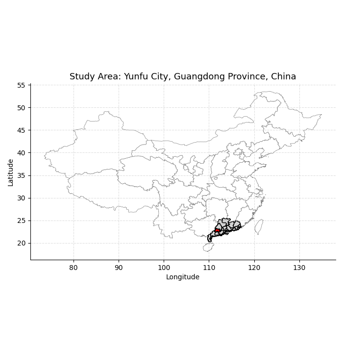
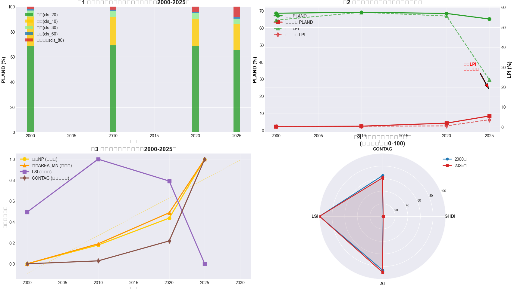
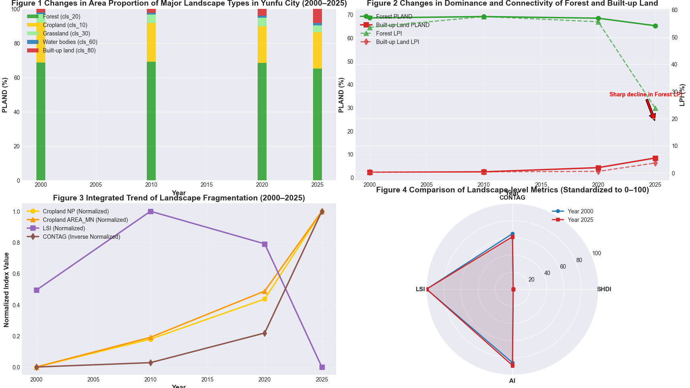

# 云浮市景观格局动态变化分析（2000—2025）

> 基于 GlobeLand30 土地利用数据与 FRAGSTATS 的景观格局分析项目

## 1. 项目简介

本项目以云浮市土地利用数据为基础，选取 **2000、2010、2020、2025 年**四个时期，利用 **FRAGSTATS** 计算土地利用/覆被的景观格局指数，分析不同土地利用类型及整体景观格局的时空变化特征。

项目重点展示从土地利用栅格数据预处理、FRAGSTATS 指标计算到结果整理与变化分析的完整流程。
## 项目展示

### 土地利用变化



### 景观格局分析



### 分析结果


## 2. 技术与工具

- **ArcGIS Pro**：土地利用栅格数据预处理、裁剪及空间数据整理
- **FRAGSTATS**：景观格局指数计算
- **Python / CSV**：结果整理与指标汇总
- **GlobeLand30**：30 m 土地利用/覆被数据

## 3. 分析流程

```text
GlobeLand30 土地利用数据
          ↓
ArcGIS Pro 数据预处理
          ↓
统一研究区、投影与栅格格式
          ↓
2000 / 2010 / 2020 / 2025
          ↓
FRAGSTATS 景观格局分析
          ↓
斑块级 / 类型级 / 景观级指标
          ↓
多时期景观格局变化分析
```

## 4. 土地利用类型

本项目采用的土地利用类别编码如下：

| 编码 | 土地利用类型 |
|---:|---|
| 10 | 耕地 |
| 20 | 林地 |
| 30 | 草地 |
| 40 | 灌木地 |
| 50 | 湿地 |
| 60 | 水体 |
| 80 | 人工表面 |
| 90 | 裸地 |

## 5. 主要景观指标

### 类型级指标

- **PLAND**：景观类型面积百分比
- **NP**：斑块数量
- **PD**：斑块密度
- **LPI**：最大斑块指数
- **ED**：边缘密度
- **AREA_MN**：平均斑块面积

### 景观级指标

- **LSI**：景观形状指数
- **CONTAG**：蔓延度
- **SHDI**：香农多样性指数
- **AI**：聚合度指数

## 6. 部分结果

FRAGSTATS 输出显示，2000—2025 年间不同土地利用类型的面积比例和斑块格局发生了明显变化。

例如：

- 林地 PLAND：**68.5886% → 65.2217%**
- 耕地 PLAND：**23.3790% → 21.1282%**
- 人工表面 PLAND：**2.1435% → 8.3258%**
- 人工表面 NP：**910 → 2432**
- 景观 SHDI：**0.8755 → 1.0010**
- 景观 CONTAG：**70.0931 → 63.8854**

这些指标可用于进一步讨论土地利用结构变化、景观破碎化及景观异质性变化。

> 注：以上数值直接整理自本项目 FRAGSTATS 输出文件，具体解释应结合研究区土地利用变化图及各指标定义进行。

## 7. 项目目录

```text
yunfu-landscape-pattern/
├── README.md
├── fragstats/
│   ├── Fragstats_project.fca
│   ├── 2000/
│   │   ├── jg2000.adj
│   │   ├── jg2000.class
│   │   └── jg2000.land
│   ├── 2010/
│   ├── 2020/
│   └── 2025/
├── results/
│   ├── class_metrics_all_years.csv
│   ├── landscape_metrics_all_years.csv
│   ├── 2000_class.csv
│   ├── 2000_land.csv
│   ├── 2010_class.csv
│   ├── 2010_land.csv
│   ├── 2020_class.csv
│   ├── 2020_land.csv
│   ├── 2025_class.csv
│   └── 2025_land.csv
└── screenshots/
    ├── Figure_1.png
    ├── Figure_2.png
    └── Figure_3.png
```

## 8. GitHub 文件说明

`fragstats/` 保存 FRAGSTATS 的主要输出文件及项目文件；`results/` 保存整理后的 CSV 指标，方便查看和二次分析；`screenshots/` 保存项目结果图。

本仓库**不上传原始 GlobeLand30 大型栅格数据**，也不包含 FRAGSTATS 软件安装程序。

## 9. 项目用途

本项目用于展示 GIS / 遥感数据分析中的土地利用变化与景观生态分析能力，重点体现：

**土地利用数据处理 → FRAGSTATS 指标计算 → 多时期指标对比 → 景观格局变化分析**

适合作为 GIS 数据分析、遥感分析及空间分析方向的项目作品集。

## 10. Author

**Hong Do Dong**

GitHub: https://github.com/hongdodong060-hash
